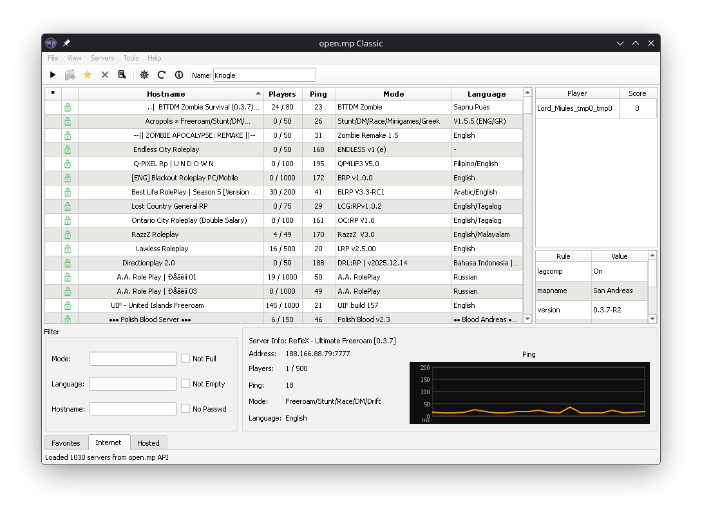

# open.mp Classic Launcher

[](https://github.com/Knogle/omp-launcher-classic/actions/workflows/build-win64.yml)
[](https://github.com/Knogle/omp-launcher-classic/releases)
[](https://github.com/Knogle/omp-launcher-classic/releases)
[](./LICENSE)



Qt-based classic launcher frontend with a Windows Rust injection helper and NSIS installer.

This is my personal hobby project around a classic open.mp-style launcher frontend.
It is an unofficial project.
It is not affiliated with, endorsed by, sponsored by, or published by open.mp or the `openmultiplayer` organization.
See [`NOTICE.md`](./NOTICE.md) for the branding and non-affiliation notice.

The project targets Win64 only.
The Qt frontend can also be built on Linux, but the Wine wrapper, GTA:SA launch path, and `samp.dll` injection flow are not finished there yet. For that reason, only Windows builds are currently produced and supported.

## Project Status

- Win64 is the primary supported target.
- GitHub Actions builds the Win64 distributable and installer on every push and pull request.
- Rust quality checks run separately on Linux for fast feedback.

## Licensing

- This repository ships with the full [MPL-2.0 license text](./LICENSE).
- This repository contains MPL-2.0-covered derivative code from `openmultiplayer/launcher`.
- See [`THIRD_PARTY_NOTICES.md`](./THIRD_PARTY_NOTICES.md) for the exact covered files and upstream references.
- See [`NOTICE.md`](./NOTICE.md) for branding and non-affiliation details.

## Repository Hygiene

- Contribution guide: [`CONTRIBUTING.md`](./CONTRIBUTING.md)
- Security policy: [`SECURITY.md`](./SECURITY.md)
- Branding and affiliation notice: [`NOTICE.md`](./NOTICE.md)
- Dependency update automation: [`.github/dependabot.yml`](./.github/dependabot.yml)
- CI workflows: [`.github/workflows`](./.github/workflows)

## Layout

- `omp-launcher-classic/`: Qt Widgets application
- `inject_helper/`: Windows helper for GTA start and DLL injection
- `nsis/`: Windows installer script
- `.github/workflows/build-win64.yml`: GitHub Actions workflow for Win64 CI builds

## Windows Build

Builds are supported for Win64 only.

Required tools:

- Visual Studio 2022 Build Tools with MSVC
- Qt 6.8.x for `win64_msvc2022_64` with Qt SVG
- Rust stable
- CMake
- Ninja
- NSIS

Fast local quality check for the Rust helper:

```bash
cargo fmt --check --manifest-path inject_helper/Cargo.toml
cargo clippy --manifest-path inject_helper/Cargo.toml --all-targets -- -D warnings
```

Native Windows build steps:

```powershell
cmake -G Ninja -S omp-launcher-classic -B build-win64/omp-launcher-classic -DCMAKE_BUILD_TYPE=Release
cmake --build build-win64/omp-launcher-classic --config Release
cargo build --locked --release --manifest-path inject_helper/Cargo.toml
```

Package the distributable folder:

```powershell
$distDir = "build-win64/omp-launcher-classic-dist"
$exePath = "build-win64/omp-launcher-classic/omp-launcher-classic.exe"
$helperPath = "inject_helper/target/release/omp-launcher-classic-inject-helper.exe"

New-Item -ItemType Directory -Force -Path $distDir | Out-Null
Copy-Item $exePath $distDir
Copy-Item $helperPath $distDir
Copy-Item "THIRD_PARTY_NOTICES.md" $distDir
windeployqt --release --no-translations --dir $distDir $exePath
```

Build the installer:

```powershell
makensis `
  /DAPP_NAME="open.mp Classic" `
  /DAPP_VERSION="working" `
  /DAPP_PUBLISHER="omp-launcher-classic contributors" `
  /DDIST_DIR="$pwd\build-win64\omp-launcher-classic-dist" `
  /DOUT_FILE="$pwd\build-win64\omp-launcher-classic-working-win64-setup.exe" `
  /DAPP_ICON="$pwd\omp-launcher-classic\assets\samp_icon.ico" `
  "$pwd\nsis\omp-launcher-classic-setup.nsi"
```

Toolbox-based Windows packaging from Linux:

```bash
./local/build_omp_launcher_classic_windows_in_devbuild.sh
./local/build_omp_launcher_classic_setup_windows_in_devbuild.sh
```

## Wine

On March 19, 2026, launcher startup was tested successfully under Lutris with `wine-11.4-amd64-wow64` using a 64-bit prefix.

## Security Notes

- `omp-client.dll` is not included for licensing reasons.
- Download it manually from `https://assets.open.mp/omp-client.dll`.
- Place it next to `omp-launcher-classic.exe` after install.
- Saved server passwords are optional and local to the current user profile.
- Exported favorites intentionally omit saved passwords.
